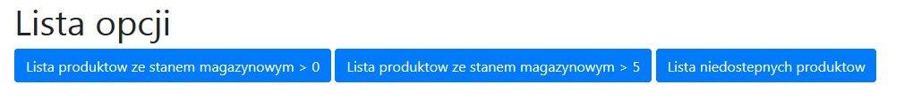

# laravel-rest-server
Package rest full server for Laravel

[](https://packagist.org/packages/prusmarcin/laravel-rest-client)
[](https://packagist.org/packages/prusmarcin/laravel-rest-client)
[](https://github.com/prusmarcin/laravel-rest-client/blob/master/LICENSE)

:package_description

- [Installation](#installation)
- [Usage](#usage)
- [Author](#author)
- [License](#license)

Installation
------------

To install this package you will need:

    Laravel 5 (see compatibility table)
    PHP 7.0 +


Install via composer - edit your `composer.json` to require the package.

``` json
{
    "require": {
        "prusmarcin/laravel-rest-client": "dev-master"
    }
}
```

Then run `composer update` in your terminal to pull it in.

Or via the command line in the root of your application installation.

``` bash
$ composer require prusmarcin/laravel-rest-client
```


Once this has finished, you will need to add the service provider to the `providers` array in your `app.php` config as follows:

``` php
\Restclient\RestclientServiceProvider::class,
```

Then execute this command

``` bash
$ php artisan vendor:publish
```
Select provider from lists `Provider: Restclient\RestclientServiceProvider` and confirm.

Then enter the `config` directory in your Laravel installation and open the `restclient.php` file.
Now set the url value where your Rest Full API server is located.

``` php
return [

    /*
    |--------------------------------------------------------------------------
    | URL Rest Server API
    |--------------------------------------------------------------------------
    */

    'url' => 'http://127.0.0.1:8000/api/'

];
```

And you're done!

Usage
-----

Run this url in browser `http://localhost/laravelzadanie/test/public/products`

WHERE `http://localhost/laravelzadanie/test/public/` <- is source your installation Laravel

Display


`http://localhost/laravelzadanie/test/public/products/available`

Display


Author
-------

- [Prus Marcin](https://github.com/prusmarcin)
- [Portfolio](https://prusmarcin.pl/)


License
-------

The MIT License (MIT). Please see [License File](https://github.com/prusmarcin/laravel-rest-client/blob/master/LICENSE) for more information.